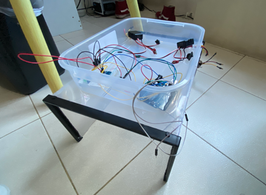

# Welcome message
This is a repository for my group's thesis: a swarm of surface vehicles that are able to communicate with one another in cleaning oceans

# Reason
The Philippines is one of the world's largest ocean polluter. In fact, some studies claim it's number 1. My group hopes to find a solution to that problem in the way we know how: automation

# Technologies used
- Tensorflow Lite (for object detection)
- Raspberry Pi (for complex multi-process controls)
- Arduino (for GPS, motor, and other hardware-related interfacing)

